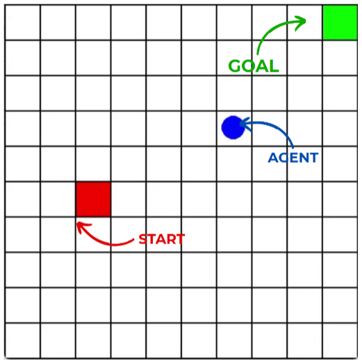
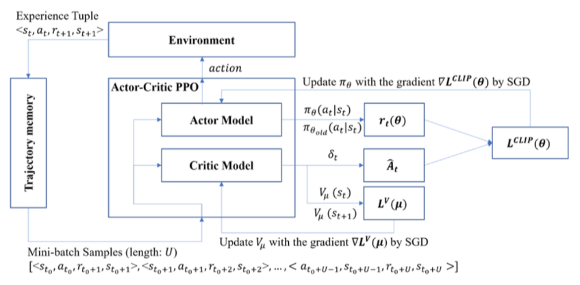
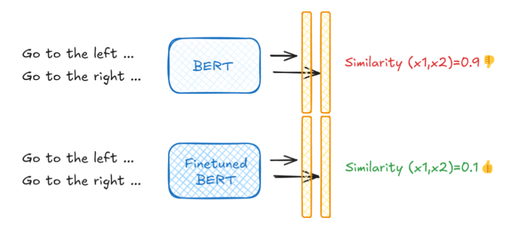
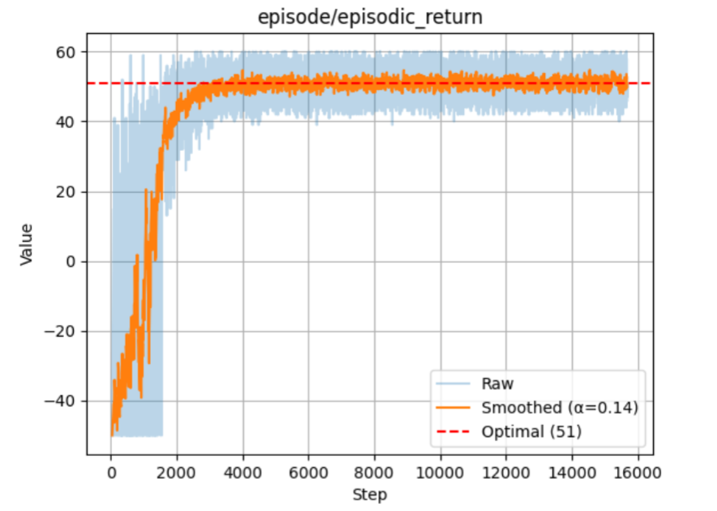
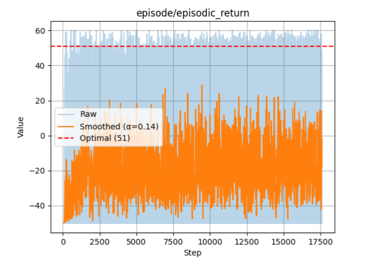
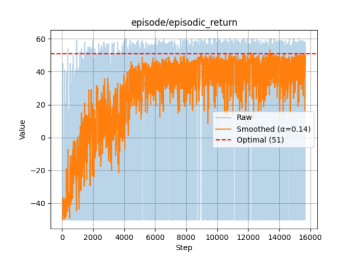
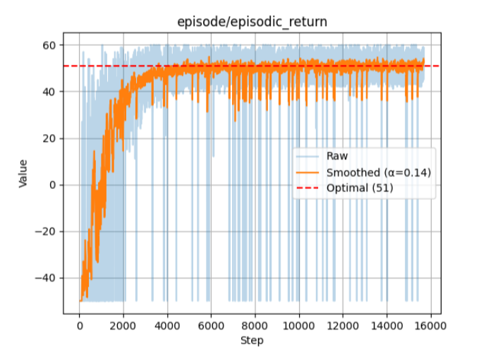
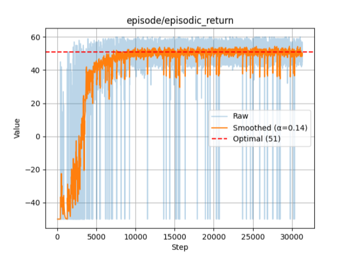

<h1 align="center">Language‑Assisted RL Agent</h1>

<p align="center">
  <a href="LICENSE"></a>
  
  
</p>

---

## 🚀 Overview
This project bridges **Natural Language Understanding** and **Reinforcement Learning** by teaching a PPO‑based agent to execute free‑form text commands inside a grid world.  
Our contributions:

* **Dual‑stream PPO** that consumes spatial & textual cues.  
* **Cross‑attention** over visual features + language embeddings.  
* **BERT fine‑tuning** (contrastive + sequence‑classification) to disambiguate subtly different instructions.  
* End‑to‑end code for data generation, training, and evaluation.

<p align="center">
  
</p>

---

## 📑 Table of Contents
1. [Environment](#environment)
2. [Dataset](#dataset)
3. [Theoretical Background](#theoretical-background)
4. [Methodology](#methodology)
5. [Experiments & Results](#experiments--results)
6. [Quick Start](#quick-start)
7. [Report & Poster](#report--poster)
8. [References](#references)

---

## Environment
A **10 × 10** grid; the goal is always one of the four corners.  
The agent’s action space: **↑ ↓ ← → ✔︎**.  
Reward = −1/step, +60 on correct “confirm”. Optimal return = 51.

---

## Dataset
We generated language prompts with the **Gemini API**, each mapped to its corner goal.

| Example Prompt                                                  | Goal |
|-----------------------------------------------------------------|------|
| Navigate to the terminal cell, utmost on the rightmost border   | (0, 9) |
| Proceed to the far left of the bottom row                       | (9, 0) |

---

## Theoretical Background
We base our agent on **Proximal Policy Optimization** (PPO).  
The clipped surrogate objective is  

$$
L_\text{clip}(θ)=\hat{\mathbb{E}}_t\Big[\min\big(r_t(θ)\hat{A}_t,\;\mathrm{clip}(r_t(θ),1-\epsilon,1+\epsilon)\hat{A}_t\big)\Big],
$$

with $r_t=\frac{π_θ}{π_{θ_\text{old}}}$.  
<p align="center">
  
</p>

---

## Methodology
### 1. Multi‑Input PPO  
* **State** = `(x, y)` **+** BERT text embedding  
* Actor & critic each two‑tower MLP → concatenation → dense head

### 2. Visual Attention PPO  
* CNN over grid image → patch tokens  
* Cross‑attention with text token to spotlight goal region

### 3. BERT Fine‑Tuning  
* **Sequence‑classification** clusters instructions by goal  
<p align="center">
  
</p>

* **Contrastive triplet loss** pushes apart near‑synonym commands  
  $\alpha_\text{dynamic}=λ_1\lVert e_a-e_p\rVert^2 + λ_2 d_\text{grid}^2$

---

## Experiments & Results

| Setting                             | Steps → Opt. | Avg. Reward | Figure |
|-------------------------------------|-------------:|------------:|:------:|
| **No language (coords only)**       | 4 k | **51** |  |
| Raw BERT embeddings                 | — | <br>poor |  |
| BERT + Contrastive Learning         | 8 k | ~50 |  |
| BERT + Sequence Classification ★    | **4 k** | **51** |  |
| Fine‑tuned BERT + Grid Attention    | 10 k | 51 |  |

_Key takeaway_: fine‑tuned text embeddings using sequence classification let the agent hit optimal performance using only natural‑language commands.

---

## Quick Start
To run **all experiments**, first setup the environment:

```bash
# 1 – Install dependencies
conda create -n larla python=3.11
conda activate larla
pip install -r requirements.txt
```

---

## Report & Poster

For the full theoretical background, implementation details, and extended results, see:

| Resource | Link |
|----------|------|
| 📑 **Project Report (PDF)** | [assets/report/report.pdf](assets/report/report.pdf) |
| 🖼️ **Summary Poster** | [assets/poster/poster.png](assets/poster/poster.png) |

---


## References
1. **Maxime Chevalier‑Boisvert**, Dzmitry Bahdanau, Salem Lahlou, Lucas Willems, Chitwan Saharia, Thien Huu Nguyen, Yoshua Bengio.  
   *BabyAI: A Platform to Study the Sample Efficiency of Grounded Language Learning.*

2. **Li Zhou**, **Kevin Small**.  
   *Inverse Reinforcement Learning with Natural Language Goals.*
